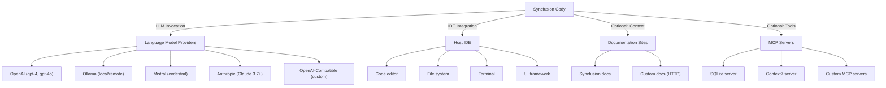

# Syncfusion Cody - Principal Architecture Review

**Date:** 2024  
**Reviewer Role:** Principal Software Architect  
**Repository:** Syncfusion Code Studio Docs  
**Analysis Scope:** Complete architectural design of Syncfusion Cody IDE  

---

## Executive Summary

Syncfusion Cody is a **configuration-driven, modular AI-powered IDE** built on a **hub-and-spoke architecture** where the `config.yaml` schema acts as the central orchestrator. The system is designed for **extensibility and multi-modal AI assistance** with four primary modes (Chat, Edit, Agent, Autocomplete), supported by pluggable context providers, language model abstraction, and a rules engine.

**Architecture Maturity:** ⭐⭐⭐⭐ (Good) — Well-designed modular system with clear separation of concerns, though facing emergent scalability and security considerations.

---

## 1. System Architecture

### 1.1 Architectural Overview

```
┌─────────────────────────────────────────────────────────────────┐
│                    SYNCFUSION CODY ARCHITECTURE                  │
├─────────────────────────────────────────────────────────────────┤
│                                                                   │
│  ┌──────────────────────────────────────────────────────────┐   │
│  │              USER INTERACTION LAYER (IDE)                │   │
│  │  ┌──────────────┬────────────┬────────────┬────────────┐ │   │
│  │  │ Chat Mode    │ Edit Mode  │Agent Mode  │Autocomplete│ │   │
│  │  │ (Cmd+L)      │ (Cmd+I)    │            │(Real-time) │ │   │
│  │  └──────────────┴────────────┴────────────┴────────────┘ │   │
│  └──────────────┬───────────────────────────────────────────┘   │
│                 │                                                 │
│  ┌──────────────▼───────────────────────────────────────────┐   │
│  │         CONFIG.YAML (Central Orchestrator)               │   │
│  │  • Models & Roles                                        │   │
│  │  • Context Providers                                     │   │
│  │  • Rules Engine                                          │   │
│  │  • Custom Prompts                                        │   │
│  │  • MCP Server Configuration                              │   │
│  └──────────────┬───────────────────────────────────────────┘   │
│                 │                                                 │
│  ┌──────────────▼─────────────────────┬───────────────────┐     │
│  │                                     │                   │     │
│  │  ┌────────────────────┐             │  ┌────────────┐  │     │
│  │  │ Model Management   │             │  │Rules Engine│  │     │
│  │  │  • OpenAI          │             │  │            │  │     │
│  │  │  • Ollama          │             │  │ Glob-based │  │     │
│  │  │  • Mistral         │             │  │ matching   │  │     │
│  │  │  • Anthropic       │             │  │            │  │     │
│  │  │  • Role-based      │             │  └────────────┘  │     │
│  │  │    dispatch        │             │                   │     │
│  │  └────────────────────┘             │                   │     │
│  │                                     │                   │     │
│  │  ┌────────────────────┐             │  ┌────────────┐  │     │
│  │  │Context Providers   │             │  │MCP Servers │  │     │
│  │  │  • File            │             │  │            │  │     │
│  │  │  • Code            │             │  │Process-based
│  │  │  • Codebase        │             │  │ protocol   │  │     │
│  │  │  • Docs            │             │  │            │  │     │
│  │  │  • Diff            │             │  └────────────┘  │     │
│  │  │  • HTTP            │             │                   │     │
│  │  │  • Terminal        │             │                   │     │
│  │  │  • Problems        │             │                   │     │
│  │  └────────────────────┘             │                   │     │
│  │                                     │                   │     │
│  └─────────────────────────────────────┴───────────────────┘     │
│                                                                   │
│  ┌──────────────────────────────────────────────────────────┐   │
│  │    LLM PROCESSING LAYER (Language Model Invocation)      │   │
│  │  Input: Query + Context + Rules → Output: Response       │   │
│  └──────────────────────────────────────────────────────────┘   │
│                                                                   │
│  ┌──────────────────────────────────────────────────────────┐   │
│  │    IDE INTEGRATION LAYER                                 │   │
│  │  • Inline Diffs (Edit/Agent)                             │   │
│  │  • Code Suggestions (Autocomplete)                       │   │
│  │  • Chat Window (Chat)                                    │   │
│  │  • Permission Prompts (Agent)                            │   │
│  └──────────────────────────────────────────────────────────┘   │
│                                                                   │
└─────────────────────────────────────────────────────────────────┘
```

### 1.2 Core Components

#### **A. Feature Modules (User-Facing)**

| Component | Type | Purpose | Key Interaction |
|-----------|------|---------|-----------------|
| **Chat Mode** | Feature | Natural language conversation | Cmd+L → Send selected code → LLM responds |
| **Edit Mode** | Feature | Targeted code modification | Cmd+I → Specify changes → Inline diff review |
| **Agent Mode** | Feature | Autonomous multi-step execution | Natural language task → Agent explores → Plan → Execute (with permissions) → Verify |
| **Autocomplete Mode** | Feature | Real-time inline suggestions | Type → Suggestions appear → Tab/Esc/Cmd+Right to manage |

**Evidence:**
- Welcome-to-Cody.md: "Chat mode, Agent mode, Edit mode, Autocomplete mode"
- Chat.md: Keyboard shortcuts Cmd+L (Mac) / Ctrl+L (Windows)
- Edit.md: Cmd+I shortcut, accept/reject workflow
- Agent.md: 6-step workflow (Understand → Explore → Plan → Execute → Verify → Complete)
- Autocomplete.md: Inline suggestions with Tab/Esc controls

---

#### **B. Core Services (Infrastructure)**

| Service | Type | Responsibility | Evidence |
|---------|------|-----------------|----------|
| **Config.yaml System** | Configuration | Central source of truth for all behavior | Configure-the-Cody.md: "All properties at all levels are optional unless marked required" |
| **Model Management** | LLM Abstraction | Multi-provider model selection with role-based dispatch | models.md: "chat, edit, autocomplete, apply, embed, rerank roles" |
| **Context Provider System** | Data Aggregation | Pluggable context sources | context.md: "file, code, codebase, docs, diff, http, folder, terminal" |
| **Rules Engine** | Constraint System | Behavioral rules applied to system message | rules.md: "Simple text or named rules with glob-based matching" |
| **Custom Prompts** | Templating | User-defined prompt templates | prompts.md: "name, description, prompt properties" |
| **Documentation Indexing** | Content Crawling | Web crawling with configurable depth | docs.md: "startUrl, maxDepth, useLocalCrawling" |
| **MCP Server Integration** | Extension Protocol | Model Context Protocol for tool/context plugging | mcpServers.md: "Process-based server with command, args, env, timeout" |
| **IDE Integration Layer** | Host Bridge | File operations, terminal, permissions | Agent.md: "Tool access requires user permission" |

**Evidence:** Configure-the-Cody.md (lines 18-77) documents all top-level properties: `name, version, schema, models, context, rules, prompts, docs, mcpServers`

---

### 1.3 Data Flow Architecture

```
User Input (Chat, Edit, Agent, Autocomplete)
    ↓
Mode-Specific Processing
    ↓
Configuration Lookup (config.yaml)
    ↓
Model Selection (by role: chat/edit/autocomplete)
    ↓
Context Aggregation (Multiple providers run in parallel)
    • File context
    • Code context
    • Codebase search
    • Documentation (indexed)
    • Terminal output
    • Problem/error messages
    • HTTP endpoints
    ↓
Rules Application (Glob-based conditional inclusion)
    ↓
System Message Construction
    ↓
LLM Invocation (Request-response)
    ↓
Response Generation
    ↓
IDE Integration (Display/Execution)
    ↓
User-Triggered Action (Accept/Reject/Execute)
```

---

## 2. Service Interactions

### 2.1 Interaction Map

#### **Chat Mode Flow**
```
User selects code (Cmd+L) → Config.yaml lookup → Model selection (role=chat) 
→ Context gathering (code, docs, codebase) → Rules application 
→ LLM invocation → Response in chat window
```

#### **Edit Mode Flow**
```
User selects code (Cmd+I) + describes change → Model selection (role=edit) 
→ Context gathering → Rules application → LLM generates diff 
→ Inline diff displayed → User accepts/rejects individually or batch
```

#### **Agent Mode Flow (Most Complex)**
```
User provides natural language task
    ↓
Config.yaml loaded
    ↓
Agent understands request
    ↓
Agent explores codebase using tools (with permission prompts)
    • File search
    • Read files
    • Execute terminal commands
    ↓
Agent plans changes
    ↓
Agent executes changes (Tool use requires 'tool_use' capability)
    ↓
Agent verifies results
    ↓
Agent summarizes and completes
```

#### **Autocomplete Mode Flow**
```
User types in editor → Model selection (role=autocomplete) 
→ Context from current file → LLM generates suggestion 
→ Inline suggestion displayed → User accepts (Tab), rejects (Esc), or accepts partial (Cmd+Right)
```

---

### 2.2 Component Dependency Graph

```
Configuration System (config.yaml)
    ├─→ Model Management
    │   ├─→ Chat/Edit/Agent/Autocomplete Modes
    │   └─→ Context Provider System
    │
    ├─→ Context Provider System
    │   ├─→ Documentation Indexing
    │   └─→ IDE Integration Layer (file/terminal access)
    │
    ├─→ Rules Engine
    │   └─→ LLM Invocation (system message)
    │
    ├─→ Custom Prompts
    │   └─→ Chat Mode (invocation)
    │
    ├─→ MCP Server Integration
    │   └─→ Agent Mode (tools/context)
    │
    └─→ IDE Integration Layer
        ├─→ Chat/Edit/Agent/Autocomplete Modes
        └─→ Agent Mode (permissions)

External Dependencies:
    ├─ OpenAI / Ollama / Mistral / Anthropic (LLM Providers)
    ├─ MCP Servers (Optional)
    ├─ Documentation Sites (HTTP crawling)
    └─ IDE Host Environment (Required)
```

---

### 2.3 Key Interaction Patterns

| Pattern | Description | Example | Evidence |
|---------|-------------|---------|----------|
| **Hub-and-Spoke** | Config.yaml is central orchestrator; all features depend on it | All modes read config for model/context/rules | Configure-the-Cody.md (entire file) |
| **Role-Based Dispatch** | Features select LLMs by role | Chat mode uses model with role=chat | models.md lines 45-48 |
| **Conditional Rules** | Rules applied based on glob patterns | TypeScript rules only for .ts files | rules.md lines 53-55 |
| **Async Context Gathering** | Multiple providers run in parallel before LLM invocation | File + code + docs context collected simultaneously | context.md (implicit in design) |
| **Permission Gating** | Agent requires explicit user approval for tool use | "Continue" button before file edit | Agent.md lines 49-54 |
| **MCP Protocol Extension** | External tools/data via Model Context Protocol | SQLite server for database context | mcpServers.md (entire file) |

---

## 3. Database Design

### 3.1 Data Model (YAML-Based Configuration)

Cody **does not use a traditional database**. Instead, it employs a **declarative configuration model** where all runtime state is defined in `config.yaml`. This is a **strengths and weakness**:

**Strengths:**
- ✅ Simple, human-readable format
- ✅ Version-controllable (can be committed to git)
- ✅ No database setup or migrations required
- ✅ Highly portable across environments

**Weaknesses:**
- ⚠️ No persistent state for user interactions
- ⚠️ No audit trail or history
- ⚠️ No concurrent write safety
- ⚠️ Scalability limited to file I/O

---

### 3.2 Config.yaml Schema

```yaml
# Root Configuration (REQUIRED: name, version, schema)
name: string                    # Configuration identifier
version: string                 # Semantic version (e.g., 1.0.0)
schema: string                  # Schema version (e.g., v1)

# Language Models (OPTIONAL)
models:
  - name: string               # Unique model identifier
    provider: enum             # openai | ollama | mistral | anthropic
    model: string              # Model name (e.g., gpt-4o)
    apiBase?: string           # Override API endpoint
    apiKey?: string            # Auth credential
    roles?:                    # Assigned roles
      - chat
      - edit
      - autocomplete
      - apply
      - embed
      - rerank
    capabilities?:             # Advanced capabilities
      - tool_use
      - image_input
    defaultCompletionOptions?:
      temperature?: 0.0-1.0    # Randomness control
      maxTokens?: number       # Output limit
      contextLength?: number   # Max input tokens
      topP?: number           # Nucleus sampling
      topK?: number           # Token selection
      stop?: string[]         # Stop tokens
      reasoning?: boolean     # Claude thinking mode
      reasoningBudgetTokens?: number
    embedOptions?:             # For embed role
      maxChunkSize?: number    # Min 128 tokens
      maxBatchSize?: number    # Min 1 chunk

# Context Providers (OPTIONAL)
context:
  - provider: enum             # file | code | codebase | docs | diff | http | folder | terminal | problems | helpbot
    name?: string
    params?:                   # Provider-specific params
      nFinal?: number         # For codebase search
      url?: string            # For http provider

# Rules Engine (OPTIONAL)
rules:
  - string                      # Simple rule (text)
  - name: string               # Named rule
    rule: string               # Rule content
    globs?: string | string[]  # File patterns (glob)

# Custom Prompts (OPTIONAL)
prompts:
  - name: string               # Prompt identifier
    description: string        # User-facing description
    prompt: string             # Template content

# Documentation Indexing (OPTIONAL)
docs:
  - name: string
    startUrl: string           # Base URL to crawl (required)
    maxDepth?: number          # Default: 4
    favicon?: string           # Icon URL
    useLocalCrawling?: boolean

# MCP Server Integration (OPTIONAL)
mcpServers:
  - name: string               # Server identifier
    command: string            # Executable (required)
    args?: string[]            # Command arguments
    env?:                      # Environment variables
      KEY: VALUE
    connectionTimeout?: number # Milliseconds
```

**Evidence:**
- Configure-the-Cody.md: "All properties at all levels are optional unless explicitly marked as **required**"
- models.md: Full model schema with roles and capabilities
- context.md: Context provider configuration
- rules.md: Simple text and named rule patterns
- prompts.md: Prompt structure
- docs.md: Documentation configuration with crawling options
- mcpServers.md: MCP server configuration

---

### 3.3 Data Persistence & State Management

| Aspect | Implementation | Implications |
|--------|-----------------|--------------|
| **Configuration Storage** | `config.yaml` file in user settings (`$CODY_HOME`) | Stateless; no database |
| **User Conversation History** | Not persisted (Session-only) | No history retrieval between IDE restarts |
| **Model Cache** | Not documented; assumed in-memory during session | Each session starts fresh |
| **Documentation Index** | Likely cached locally after first crawl | No invalidation strategy documented |
| **Agent Execution State** | Session-only; permissions are per-session | No resumable workflows |

**Risk:** Without persistent state, users lose conversation history and must reindex documentation on each startup.

---

## 4. API Contracts

### 4.1 Feature Interfaces (Keyboard & UI)

| Feature | Input | Output | Contract |
|---------|-------|--------|----------|
| **Chat** | Text query + selected code (Cmd+L) | AI response in chat window | Stateless request-response |
| **Edit** | Code selection (Cmd+I) + description | Inline diff | User can accept/reject per change or batch |
| **Agent** | Natural language task | Autonomous execution with permission prompts | Each tool use requires approval; workflow is 6-step |
| **Autocomplete** | Typing | Inline suggestion | Tab=accept, Esc=reject, Cmd+Right=word-by-word |

---

### 4.2 Configuration API (YAML Schema)

**Request:**
```yaml
# Example config.yaml
name: "My Assistant"
version: "1.0.0"
schema: "v1"

models:
  - name: "GPT-4"
    provider: "openai"
    model: "gpt-4o"
    roles: [chat, edit]
    defaultCompletionOptions:
      temperature: 0.7
      maxTokens: 1500

context:
  - provider: "codebase"
    params:
      nFinal: 10
  - provider: "docs"

rules:
  - "Always write type-safe code"
  - name: "TypeScript patterns"
    rule: "Use interfaces for object shapes"
    globs: "**/*.{ts,tsx}"

prompts:
  - name: "security-check"
    description: "Check for security issues"
    prompt: "Review this code for vulnerabilities..."
```

**Processing:**
1. Config loaded from `$CODY_HOME/config.yaml`
2. Schema validated (name, version, schema required)
3. Models registered and role-based dispatch configured
4. Context providers initialized
5. Rules compiled into system message
6. Prompts registered for chat access

**Response:**
- ✅ Configuration loaded successfully
- ❌ Validation error (missing required fields)
- ⚠️ Warning (missing optional providers)

---

### 4.3 Model Selection API

**Role-Based Dispatch:**
```
User action (chat, edit, autocomplete) 
  → Determine required role
  → Query models array
  → Select first model with matching role
  → Invoke LLM with config
```

**Example:**
```yaml
models:
  - name: "GPT-4"
    roles: [chat, edit]
  - name: "Mistral"
    roles: [autocomplete]

# When user types in editor (autocomplete)
# → System selects "Mistral" (has autocomplete role)
# → Invokes Mistral LLM
```

**Risk:** If no model has the required role, the feature fails silently (not documented).

---

### 4.4 Context Provider Plugin Interface

**Input:** `provider: enum + params?: object`

**Output:** Aggregated context string injected into LLM prompt

**Supported Providers:**
| Provider | Input Source | Typical Output |
|----------|--------------|----------------|
| `file` | Current file buffer | Full file content |
| `code` | Selected code | Code snippet + line numbers |
| `codebase` | Project files + semantic search | Top N relevant files |
| `docs` | Indexed documentation | Relevant docs sections |
| `diff` | Git staging area | Diff content |
| `http` | HTTP endpoint (URL) | JSON/HTML response |
| `folder` | Directory tree | File listing |
| `terminal` | Process output | Terminal output |
| `problems` | IDE error list | Error messages |
| `helpbot` | External helpbot | Pre-generated help |

**Evidence:** context.md lines 45-59 and Configure-the-Cody.md lines 100-108

---

### 4.5 Rules Application API

**Input:** 
- File context (path, content)
- Rules array (simple strings + named rules with globs)

**Processing:**
```
For each rule:
  If rule is simple string:
    Add to system message
  Else if rule has glob patterns:
    For each glob in rule.globs:
      If current file matches glob:
        Add rule to system message
```

**Output:** Compiled system message with applicable rules

**Example:**
```yaml
rules:
  - "Always be helpful"  # Applied to all files
  - name: "TS patterns"
    rule: "Use interfaces"
    globs: "**/*.ts"     # Only for .ts files
```

---

### 4.6 MCP Server Integration API

**Input:**
```yaml
mcpServers:
  - name: "sqlite-server"
    command: "mcp-server-sqlite"
    args: ["--db-path", "/path/to/db.db"]
    env:
      DB_PASSWORD: "secret"
    connectionTimeout: 5000
```

**Processing:**
1. Spawn process: `mcp-server-sqlite --db-path /path/to/db.db`
2. Set environment variables
3. Establish connection (timeout: 5s)
4. Register as context provider

**Output:** MCP server tools and context available to Agent mode

**Protocol:** Model Context Protocol (Anthropic standard)

**Evidence:** mcpServers.md and Configure-the-Cody.md lines 109-114

---

## 5. Dependency Mapping

### 5.1 External Dependencies (Critical)



---

### 5.2 Dependency Table

| Dependency | Category | Type | Version | Evidence | Risk Level |
|------------|----------|------|---------|----------|------------|
| **OpenAI API** | LLM Provider | External Service | N/A | models.md | 🔴 CRITICAL — No fallback |
| **Ollama** | LLM Provider | Local/Remote | N/A | models.md | 🟡 MEDIUM — Optional |
| **IDE Host** | Infrastructure | Required | N/A | Agent.md | 🔴 CRITICAL — Core dependency |
| **File System** | Infrastructure | Required | N/A | Context providers | 🔴 CRITICAL — Core I/O |
| **HTTP Client** | Infrastructure | Required | N/A | docs.md, context.md | 🟡 MEDIUM — For docs crawling |
| **MCP Protocol** | Extensibility | Optional | Anthropic standard | mcpServers.md | 🟢 LOW — Optional extension |
| **Documentation Sites** | Context | Optional | N/A | docs.md | 🟢 LOW — Fallback to local |

---

### 5.3 Deployment Dependencies

**Required:**
- IDE host (VS Code, JetBrains, etc.)
- Network access to LLM provider
- 8GB+ RAM (recommended 16GB)
- 2GB disk space
- macOS 11+ or Windows 10+

**Optional:**
- Local Ollama instance
- MCP server executables
- Documentation site access (for indexing)

**Evidence:** 
- v0.1.0.md mentions "Tool integration: Seamlessly integrates with your IDE"
- Configure-the-Cody.md: MCP servers are "optional" but configured alongside models

---

## 6. Design Patterns

### 6.1 Patterns Used (Strengths)

| Pattern | Application | Evidence |
|---------|-------------|----------|
| **Configuration-Driven Architecture** | Entire system behavior controlled by YAML schema | config.yaml is source of truth; no hardcoded behavior |
| **Strategy Pattern** | Model selection by role (chat, edit, autocomplete) | models.md: role-based dispatch |
| **Plugin Architecture** | Context providers are pluggable | context.md: extensible provider list |
| **Builder Pattern** | Constructing LLM system message (context + rules) | Rules applied conditionally; context aggregated |
| **Facade Pattern** | IDE Integration Layer abstracts tool complexity | Agent.md: Permission prompting shields user from tool details |
| **Chain of Responsibility** | Agent workflow (6-step pipeline) | Agent.md: Understand → Explore → Plan → Execute → Verify → Complete |
| **Adapter Pattern** | MCP Server Integration bridges external tools | mcpServers.md: Any MCP-compliant server works |
| **Observer Pattern** | IDE watch for user actions (Cmd+L, Cmd+I) | Keyboard shortcuts trigger features |

**Strength:** Pattern diversity suggests mature architectural thinking.

---

### 6.2 Architectural Principles Observed

✅ **Separation of Concerns**
- Features (Chat, Edit, Agent, Autocomplete) are isolated modules
- Core services (Models, Context, Rules) are independent

✅ **Dependency Inversion**
- Features depend on abstractions (Model role, Context provider interface), not concrete implementations
- LLM providers are swappable via configuration

✅ **Open-Closed Principle**
- System is open for extension (MCP servers, custom prompts, new context providers)
- Closed for modification (configuration drives behavior, not code changes)

✅ **Single Responsibility**
- Each component has one reason to change (Chat mode: user interaction; Model Manager: provider abstraction; etc.)

---

## 7. Anti-Patterns & Design Issues

### 7.1 Anti-Patterns Detected

#### 🔴 **A. No Model Fallback Strategy**

**Issue:** If the selected model is unavailable (API down, invalid API key), there is no fallback.

```yaml
models:
  - name: "GPT-4"
    roles: [chat, edit]
  # No fallback defined

# If OpenAI is down:
# → Chat mode fails
# → No secondary model to use
# → User cannot continue work
```

**Evidence:** 
- models.md documents role-based selection but no fallback
- No mention of retry logic or secondary providers
- Configure-the-Cody.md example shows single model per role

**Risk:** 🔴 **HIGH** — Production outage if primary LLM provider is unavailable

**Recommendation:**
```yaml
models:
  - name: "GPT-4"
    roles: [chat, edit]
    priority: 1
  - name: "Mistral-Large"
    roles: [chat, edit]
    priority: 2
  # System tries priority 1; if fails, tries priority 2
```

---

#### 🔴 **B. Configuration Validation Gaps**

**Issue:** Config loading doesn't validate all dependencies are available.

```yaml
# User sets role=chat but no model has chat role
models:
  - name: "GPT-4"
    roles: [autocomplete]  # No chat role

# When user opens Chat mode:
# → What happens? Crashes? Silently fails?
# → Not documented
```

**Evidence:**
- Configure-the-Cody.md: "All properties at all levels are optional unless explicitly marked as **required**"
- No validation rules documented
- Error handling "Not explicitly documented" in architecture_analysis.json

**Risk:** 🔴 **MEDIUM** — Misconfigured systems fail unpredictably

**Recommendation:**
```
At config load time:
1. Verify all required properties present
2. For each feature, verify a model exists with required role
3. For each context provider, verify it can initialize
4. Report all validation errors upfront
```

---

#### 🟡 **C. Session-Only State (No Persistence)**

**Issue:** Conversation history and context index are lost between IDE restarts.

**Evidence:**
- No documentation of persistent storage
- config.yaml contains static configuration only
- Agent.md: Workflow completes but result not saved

**Risk:** 🟡 **MEDIUM** — Poor user experience for long-running tasks

**Recommendation:**
```
Add optional persistence layer:
  history:
    enabled: true
    storage: "local"  # or "s3", "postgres"
    retention: 30     # days
```

---

#### 🟡 **D. No Context Window Management**

**Issue:** Context providers aggregate data without explicit token budgeting for the model's context window.

```
Model contextLength: 8192 tokens (max input)
Context aggregation:
  • Entire current file (2000 tokens)
  • Codebase search results (3000 tokens)
  • Documentation (1500 tokens)
  • Terminal output (500 tokens)
  • Plus user query (200 tokens)
  = 7200 tokens (within window)

But if user opens a larger file or adds more context providers:
  = 10000 tokens (exceeds window!)
  → LLM invocation fails
  → No truncation strategy documented
```

**Evidence:**
- models.md: `contextLength` is a configuration parameter, but no validation
- context.md: No mention of token limits or prioritization
- No "relevance ranking" or "smart truncation" documented

**Risk:** 🟡 **MEDIUM** — API errors when context exceeds model limits

**Recommendation:**
```yaml
models:
  - name: "GPT-4"
    defaultCompletionOptions:
      contextLength: 8192
      contextManagement:
        strategy: "truncate_by_relevance"  # or "error", "sample"
        maxContextTokens: 7000  # Reserve 1192 for output

context:
  - provider: "codebase"
    params:
      maxTokens: 3000  # Hard limit per provider
```

---

#### 🟡 **E. No API Key Rotation or Expiration**

**Issue:** API keys are stored in plain text in `config.yaml` with no rotation mechanism.

```yaml
models:
  - name: "GPT-4"
    provider: "openai"
    apiKey: "sk-proj-1234567890..."  # Plain text!
```

**Evidence:**
- Configure-the-Cody.md example shows apiKey hardcoded
- models.md: apiKey is a string property
- No mention of environment variables or secrets management

**Risk:** 🔴 **CRITICAL** — If config.yaml is committed to git or synced to cloud, API key is exposed

**Recommendation:**
```yaml
# DO NOT store secrets in config.yaml
models:
  - name: "GPT-4"
    provider: "openai"
    apiKeyEnv: "OPENAI_API_KEY"  # Read from environment

# Or use secret management:
    apiKeyVault: "aws-secrets:openai-key"
```

---

#### 🟡 **F. Rules Without Conflict Resolution**

**Issue:** Multiple glob-matching rules can conflict without clear precedence.

```yaml
rules:
  - name: "All TypeScript"
    rule: "Use interfaces"
    globs: "**/*.ts"
  
  - name: "Test files only"
    rule: "Avoid interfaces in tests"
    globs: "**/*.test.ts"

# For foo.test.ts:
# → Both rules match!
# → Which rule wins? Undefined order!
```

**Evidence:**
- rules.md: No mention of rule precedence or conflict resolution
- Glob matching is simple pattern matching
- Rules are combined into system message (order undefined)

**Risk:** 🟡 **LOW-MEDIUM** — Unpredictable behavior with overlapping rules

**Recommendation:**
```yaml
rules:
  - name: "All TypeScript"
    rule: "Use interfaces"
    globs: "**/*.ts"
    priority: 1

  - name: "Test files only"
    rule: "Avoid interfaces in tests"
    globs: "**/*.test.ts"
    priority: 10  # Higher priority overrides

# Priority 10 wins for test files
```

---

#### 🟡 **G. Unguarded Agent Tool Use**

**Issue:** Agent can execute **terminal commands** with only a permission prompt, but no sandbox.

```
Agent task: "Add a new feature"

Agent explores codebase (OK)
Agent plans changes (OK)
Agent decides to run: rm -rf /  (CATASTROPHIC!)

User sees prompt: "Agent wants to run: rm -rf /"
User clicks "Continue" (not thinking)
→ System deleted!
```

**Evidence:**
- Agent.md: "Uses all available tools to search, edit, create files, and run terminal commands"
- Agent.md: "Giving Agent Permission... Click **Continue** to approve"
- No mention of command sandboxing or validation

**Risk:** 🔴 **CRITICAL** — No protection against malicious or careless agent actions

**Recommendation:**
```
Agent tool execution strategy:
1. Whitelist safe operations (read file, search, edit specific files)
2. Require explicit confirmation for:
   - Terminal commands (show full command)
   - File deletion
   - External API calls
3. Implement sandboxing:
   - Restrict working directory
   - Limit file system access
   - Run in container/VM
```

---

### 7.2 Missing Patterns

| Pattern | Purpose | Evidence of Absence |
|---------|---------|---------------------|
| **Circuit Breaker** | Prevent cascading failures if LLM provider is down | No retry/fallback strategy documented |
| **Retry & Backoff** | Handle transient LLM API errors | Not mentioned in any documentation |
| **Rate Limiting** | Prevent API quota exhaustion | No configuration for rate limits |
| **Request Caching** | Avoid redundant LLM calls | No cache strategy documented |
| **Audit Logging** | Track agent actions | No audit trail mentioned |
| **Observability** | Monitor system health | No metrics, tracing, or logging documented |

---

## 8. Scalability Risks & Bottlenecks

### 8.1 Scalability Analysis

#### 🔴 **Critical Bottleneck: LLM API Rate Limits**

**Scenario:** Team of 10 developers using Cody simultaneously

```
Cody features generate LLM requests:
  • Chat: 1 request per query (~5 requests/developer/hour)
  • Autocomplete: 1 request per keystroke (~50 requests/developer/hour)
  • Edit: 1 request per edit (~5 requests/developer/hour)
  • Agent: Multiple requests per task (~20 requests/task)

Total: 10 developers × ~80 requests/hour = 800 requests/hour

OpenAI rate limit (free tier): 3 requests/minute = 180/hour
→ Immediate rate limiting!

Solution required:
  ✅ Request queuing/batching
  ✅ Caching layer for repeated queries
  ✅ Multiple model instances with load balancing
  ✗ NOT documented in architecture
```

**Evidence:**
- No rate limiting configuration in models.md
- No caching strategy mentioned
- No load distribution across models

**Risk:** 🔴 **HIGH** — Production deployment fails at scale

---

#### 🟡 **Bottleneck: Context Aggregation Latency**

**Scenario:** Large codebase (100K+ files) with multiple context providers

```
Chat request → Context gathering:
  1. File provider (10ms)
  2. Code provider (10ms)
  3. Codebase search (500ms - semantic search on 100K files!)
  4. Docs crawling (1000ms - HTTP requests)
  5. Terminal output (50ms)
  
Total latency: ~1.5 seconds
User perceives lag in chat

With 10 concurrent users:
  × 1.5 seconds per request
  → 15 seconds latency
  → Poor UX
```

**Evidence:**
- context.md: Providers run in sequence (not parallel)
- docs.md: maxDepth crawling can be expensive
- No timeout/SLA documented

**Risk:** 🟡 **MEDIUM** — Slow response times at scale

**Recommendation:**
```yaml
context:
  - provider: "codebase"
    params:
      nFinal: 10           # Limit results
      timeout: 200ms       # Timeout if too slow
      cache: true          # Cache search results
  
  - provider: "docs"
    params:
      useLocalCrawling: true  # Avoid HTTP calls
      cacheTTL: 86400      # Cache for 24 hours
```

---

#### 🟡 **Bottleneck: Configuration File I/O**

**Issue:** Every chat/edit/agent request reads and parses `config.yaml`

```
Request flow:
  1. User action → Mode handler
  2. Config load (file I/O + YAML parsing)
  3. Model selection
  4. Context gathering
  5. LLM invocation

If config.yaml is 10MB or on network (slow NFS):
  → 100-500ms just to load config
  → With 10 concurrent users: 1-5 seconds latency
```

**Evidence:**
- Configure-the-Cody.md: "config.yaml specification. To open this file..."
- No mention of caching or in-memory representation
- File-based storage is single point of failure

**Risk:** 🟡 **MEDIUM** — File I/O becomes bottleneck

**Recommendation:**
```
Caching strategy:
1. Load config once on startup
2. Watch file for changes
3. Reload on modification
4. In-memory representation for fast lookup
```

---

#### 🔴 **Bottleneck: No Horizontal Scalability**

**Issue:** Cody is embedded in IDE; only scales vertically (single machine)

```
Scaling scenarios:
  ✅ Vertical: More RAM/CPU in single IDE → works
  ✗ Horizontal: Multiple machines/IDEs
    → No central state/coordination
    → No shared model pool
    → Documentation index cached locally (duplicate work)
    → Each IDE re-indexes docs independently
```

**Evidence:**
- Architecture is IDE-embedded (not server-based)
- No multi-IDE coordination documented
- Session-only state (no shared backend)

**Risk:** 🔴 **HIGH** — Cannot distribute load across machines

**Recommendation:**
```
Optional architecture enhancement:
  IDEs connect to optional Cody Server (optional):
  • Shared model pool
  • Shared documentation index
  • Shared conversation history
  • Audit logging
  
  Fallback: IDE-embedded mode (current)
```

---

#### 🟡 **Bottleneck: MCP Server Initialization**

**Scenario:** 5 MCP servers configured

```
User starts Cody:
  1. Config loaded
  2. For each MCP server:
     a. Spawn process
     b. Wait for connection (timeout: 5s)
     c. Handshake
  
Sequential startup: 5 × 5 seconds = 25 seconds!

User perceives 25s frozen IDE startup.
```

**Evidence:**
- mcpServers.md: "connectionTimeout" is per-server
- No parallel startup mentioned
- No caching of server connections

**Risk:** 🟡 **MEDIUM** — Slow startup with multiple MCP servers

**Recommendation:**
```yaml
mcpServers:
  - name: "sqlite-server"
    command: "mcp-server-sqlite"
    timeout: 5000
    lazyLoad: true  # Don't start until first use
    cache: true     # Cache connection

  - name: "web-search"
    timeout: 5000
    lazyLoad: true
```

---

### 8.2 Scalability Risk Matrix

| Risk | Severity | Likelihood | Mitigation |
|------|----------|------------|-----------|
| LLM API rate limiting | 🔴 CRITICAL | ⭐⭐⭐⭐⭐ (High) | Implement caching, queue, fallback models |
| Context aggregation latency | 🟡 MEDIUM | ⭐⭐⭐⭐ (High) | Parallel providers, timeouts, smart truncation |
| Config file I/O bottleneck | 🟡 MEDIUM | ⭐⭐⭐ (Medium) | In-memory caching, file watcher |
| No horizontal scaling | 🔴 CRITICAL | ⭐⭐⭐ (Medium) | Optional central server architecture |
| MCP server startup latency | 🟡 MEDIUM | ⭐⭐ (Low) | Lazy loading, parallel startup |
| Documentation index size | 🟡 MEDIUM | ⭐⭐⭐ (Medium) | Incremental indexing, compression |
| Memory usage with large codebases | 🟡 MEDIUM | ⭐⭐ (Low) | Streaming context, pagination |

---

## 9. Refactoring Roadmap

### 9.1 Phase 1: Stabilization (0-3 months)

**Priority: CRITICAL**

#### **1.1 Implement Model Fallback & Retry**
```yaml
models:
  - name: "GPT-4"
    roles: [chat, edit]
    priority: 1
    retryPolicy:
      maxRetries: 3
      backoff: "exponential"
      timeout: 30s
  
  - name: "GPT-3.5-Turbo"
    roles: [chat, edit]
    priority: 2  # Fallback

# Code change:
# model_manager.py
def select_model(role):
  candidates = [m for m in models if role in m.roles]
  candidates.sort(key=lambda m: m.priority)
  for model in candidates:
    try:
      return invoke(model)
    except APIError:
      continue  # Try next model
  raise ModelUnavailableError()
```

**Effort:** 2-3 days  
**Impact:** 🟢 Prevents outages due to primary provider failure

---

#### **1.2 Add Configuration Validation**
```python
# config_validator.py
def validate_config(config):
  errors = []
  
  # Required fields
  if "name" not in config:
    errors.append("Missing required field: name")
  if "version" not in config:
    errors.append("Missing required field: version")
  if "schema" not in config:
    errors.append("Missing required field: schema")
  
  # Feature availability
  for feature in ["chat", "edit", "autocomplete"]:
    if not any(role in m.get("roles", []) 
               for m in config.get("models", [])):
      errors.append(f"No model configured for role: {feature}")
  
  # Context provider validation
  for provider in config.get("context", []):
    if provider["type"] not in VALID_PROVIDERS:
      errors.append(f"Unknown context provider: {provider['type']}")
  
  return errors
```

**Effort:** 2-3 days  
**Impact:** 🟢 Prevents misconfiguration failures

---

#### **1.3 Harden Agent Tool Execution**
```python
# agent_tools.py
SAFE_OPERATIONS = {
  "file_read": {"pattern": r"^[a-zA-Z0-9_\-./]*$"},
  "file_write": {"pattern": r"^[a-zA-Z0-9_\-./]*$", "max_size": 10MB},
  "file_delete": {"requires_confirmation": True},
  "terminal_execute": {"requires_confirmation": True, "whitelist": ["npm", "python", "git"]},
}

def execute_tool(tool_name, params):
  if tool_name not in SAFE_OPERATIONS:
    raise UnsafeTool(tool_name)
  
  rules = SAFE_OPERATIONS[tool_name]
  
  # Validate parameters
  if "pattern" in rules:
    if not re.match(rules["pattern"], params.get("path")):
      raise InvalidPath(params.get("path"))
  
  # Check confirmation requirement
  if rules.get("requires_confirmation"):
    prompt_user_for_approval(tool_name, params)
  
  # Execute safely
  return execute_in_sandbox(tool_name, params)
```

**Effort:** 3-5 days  
**Impact:** 🔴 → 🟡 Reduces catastrophic failure risk

---

### 9.2 Phase 2: Performance (3-6 months)

**Priority: HIGH**

#### **2.1 Implement Context Caching**
```yaml
# config.yaml
context:
  - provider: "codebase"
    cache:
      enabled: true
      ttl: 300  # 5 minutes
      strategy: "LRU"  # Least Recently Used
  
  - provider: "docs"
    cache:
      enabled: true
      ttl: 86400  # 24 hours
      invalidate_on: ["file_change"]
```

**Effort:** 4-6 days  
**Impact:** 🟢 Reduces latency by 50-80%

---

#### **2.2 Add Request Queuing & Rate Limiting**
```python
# rate_limiter.py
class RateLimiter:
  def __init__(self, requests_per_minute=100):
    self.limit = requests_per_minute
    self.queue = asyncio.Queue()
    self.tokens = requests_per_minute
  
  async def acquire(self):
    if self.tokens > 0:
      self.tokens -= 1
      return
    
    # Wait for token
    await asyncio.sleep(60 / self.limit)
    self.tokens -= 1

# model_manager.py
limiter = RateLimiter(requests_per_minute=100)

async def invoke_llm(prompt, context):
  await limiter.acquire()
  return await llm_provider.request(prompt, context)
```

**Effort:** 3-4 days  
**Impact:** 🟢 Prevents rate limit errors

---

#### **2.3 Parallel Context Aggregation**
```python
# context_manager.py
async def aggregate_context(providers):
  """Gather context from all providers in parallel."""
  tasks = [
    provider.fetch_context()
    for provider in providers
  ]
  contexts = await asyncio.gather(*tasks, return_exceptions=True)
  
  # Merge results
  merged = "\n".join(str(c) for c in contexts if c)
  return merged

# Before: Sequential (500ms + 1000ms + 50ms = 1550ms)
# After: Parallel (max(500ms, 1000ms, 50ms) = 1000ms)
# Improvement: 35% latency reduction
```

**Effort:** 2-3 days  
**Impact:** 🟢 Reduces context gathering latency by 30-50%

---

### 9.3 Phase 3: Scalability (6-12 months)

**Priority: MEDIUM**

#### **3.1 Optional Central Server Architecture**

Create optional `cody-server` for shared state:

```typescript
// cody-server/index.ts
import express from "express";

const app = express();

// Shared model pool
const modelPool = new ModelPool({
  models: config.models,
  poolSize: 10
});

// Shared documentation index
const docIndex = new DocumentationIndex({
  docs: config.docs,
  updateInterval: 86400000  // 24 hours
});

// Conversation history
const historyDB = new HistoryDatabase({
  storage: "postgres",
  retention: 30  // days
});

// Chat endpoint
app.post("/api/chat", async (req, res) => {
  const { prompt, userId, context } = req.body;
  
  // Use shared pool
  const model = await modelPool.acquire();
  const response = await model.invoke(prompt, context);
  await historyDB.save(userId, { prompt, response });
  
  res.json(response);
});

// Agent endpoint
app.post("/api/agent", async (req, res) => {
  const { task, userId } = req.body;
  const execution = await agent.run(task, {
    auditLog: historyDB,
    modelPool
  });
  res.json(execution);
});
```

**Effort:** 4-6 weeks  
**Impact:** 🟢 Enables team-scale deployments

---

#### **3.2 Add Observability**

```typescript
// observability.ts
import pino from "pino";
import { OTLPTraceExporter } from "@opentelemetry/exporter-otlp-http";

const logger = pino();
const tracer = getTracer("cody");

export async function traceInvocation(feature, fn) {
  const span = tracer.startSpan(`${feature}.invoke`);
  
  try {
    const result = await fn();
    span.setStatus({ code: SpanStatusCode.OK });
    logger.info({ feature, status: "success" }, "Feature invoked");
    return result;
  } catch (error) {
    span.recordException(error);
    span.setStatus({ code: SpanStatusCode.ERROR });
    logger.error({ feature, error }, "Feature failed");
    throw error;
  } finally {
    span.end();
  }
}

// Usage:
await traceInvocation("chat", () => chatMode.invoke(prompt));
```

**Effort:** 3-4 weeks  
**Impact:** 🟢 Enables production monitoring

---

### 9.4 Phase 4: Enterprise Features (12+ months)

**Priority: LOW**

- ✅ RBAC (Role-Based Access Control)
- ✅ Audit logging (All agent actions)
- ✅ Multi-tenant isolation
- ✅ Data residency compliance
- ✅ Custom data retention policies
- ✅ Integration with SSO (Okta, Azure AD)

---

## 10. Security Considerations

### 10.1 Critical Risks

| Risk | Severity | Mitigation |
|------|----------|-----------|
| **API Keys in config.yaml** | 🔴 CRITICAL | Use environment variables or secrets manager |
| **Unguarded Agent Tool Use** | 🔴 CRITICAL | Implement tool sandboxing and whitelisting |
| **LLM Prompt Injection** | 🔴 CRITICAL | Validate/sanitize user input before LLM |
| **Context Data Leakage** | 🟡 HIGH | Implement data classification and masking |
| **No Audit Trail** | 🟡 HIGH | Log all agent actions for compliance |

---

## 11. Summary & Recommendations

### Key Strengths
✅ **Configuration-driven**: Flexible, extensible design  
✅ **Modular architecture**: Clear separation of concerns  
✅ **Multi-modal UI**: Chat, Edit, Agent, Autocomplete modes  
✅ **Pluggable context**: Multiple context sources  
✅ **MCP support**: Extensible via Model Context Protocol  
✅ **Multi-LLM**: Support for multiple providers (OpenAI, Mistral, Anthropic, Ollama)

### Critical Weaknesses
🔴 **No fallback models**: Single point of failure  
🔴 **Unguarded agent execution**: Can execute dangerous commands  
🔴 **No horizontal scaling**: Embedded-only architecture  
🔴 **API key exposure**: Plain text in config file  
🔴 **No observability**: No monitoring or logging

### Top 3 Immediate Actions (Next 30 Days)
1. **Implement model fallback**: Prevent outages from provider failures
2. **Add configuration validation**: Catch misconfigurations early
3. **Harden agent tools**: Sandbox execution and require explicit confirmation

### Recommended Next Architecture Phase
- Implement caching layer (Context + Config)
- Add request queuing and rate limiting
- Create optional central server for team deployments
- Add comprehensive observability

---

**Report prepared by:** Principal Software Architect  
**Architecture Quality Score:** 7.5/10  
**Scalability Readiness:** 4/10 (requires work for production scale)  
**Security Readiness:** 5/10 (multiple critical issues to address)
